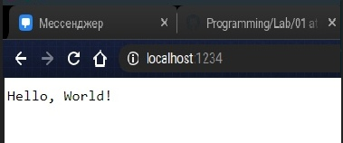
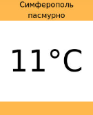
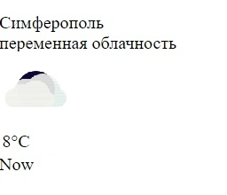

<p align="center">МИНИСТЕРСТВО НАУКИ  И ВЫСШЕГО ОБРАЗОВАНИЯ РОССИЙСКОЙ ФЕДЕРАЦИИ<br>

<p align="center">Федеральное государственное автономное образовательное учреждение высшего образования<br>

<p align="center">"КРЫМСКИЙ ФЕДЕРАЛЬНЫЙ УНИВЕРСИТЕТ им. В. И. ВЕРНАДСКОГО"<br>

<p align="center">ФИЗИКО-ТЕХНИЧЕСКИЙ ИНСТИТУТ<br>

<p align="center">Кафедра компьютерной инженерии и моделирования</p>

<br>

<h3 align="center">Отчёт по лабораторной работе № 1<br> по дисциплине "Программирование"</h3>

<br><br>

<p>студента 1 курса группы ПИ-б-о-203<br>

Сависько Эдуард Максимович<br>

направления подготовки 09.03.04 "Программная инженерия"</p>

<br><br>

<table>

<tr><td>Научный руководитель<br> старший преподаватель кафедры<br> компьютерной инженерии и моделирования</td>

<td>(оценка)</td>

<td>Чабанов В.В.</td>

</tr>

</table>

<br><br>

<p align="center">Симферополь, 2020</p>

<hr>
<h2> Постановка задачи </h2>

Разработать сервис предоставляющий данные о погоде в городе Симферополе на момент запроса. В качестве источника данных о погоде используйте: [http://openweathermap.org/](http://openweathermap.org/). В состав сервиса входит: серверное приложение на языке С++ и клиентское приложение на языке Python.

Серверное приложение (далее Сервер) предназначенное для обслуживания клиентских приложений и минимизации количества запросов к сервису _openweathermap.org_. Сервер должен обеспечивать возможность получения данных в формате JSON и виде _html_ виджета (для вставки виджета на страницу будет использоваться _[iframe](https://habr.com/ru/post/488516/)_).

Клиентское приложение должно иметь графический интерфейс отображающий сведения о погоде и возможность обновления данных по требованию пользователя.

Подробности указаны далее.
<h2>Выполнение работы</h2>

 <br>1) Был сгенерирован API key на сайте https://openweathermap.org/ - b1c53fb5c5c8568523e672a58733c718<br>
 2) Далее был сделан базовый клиент сервера, который в дальнейшем будет редактироваться.<br>
 
 
 3) Изучили пример ответа от сайта worldtimeapi<br>
 
 
 4) Написали серверное приложение на языке C++
 
 ```cpp
#include <iostream>
#include <Main/include/cpp_httplib/httplib.h>
#include <Main/include/nlohmann/json.hpp>
#include <string>
#include <fstream>
#include <sstream>

using namespace httplib;
using namespace std;
using json = nlohmann::json;

void Replacement(std::string& data, std::string toSearch, std::string replaceStr) {
    size_t pos = data.find(toSearch);
    while (pos != std::string::npos) {
        data.replace(pos, toSearch.size(), replaceStr);
        pos = data.find(toSearch, pos + replaceStr.size());
    }
}

void gen_response(const Request& req, Response& res) {
    setlocale(LC_CTYPE, "rus");
    string CurrentWeather;
    string Picture;
    float Temp;

    Client cli1("http://worldtimeapi.org");
    // Отправляем get-запрос и ждём ответ, который сохраняется в переменной res
    auto res1 = cli1.Get("/api/timezone/Europe/Simferopol");
    // res преобразуется в true, если запрос-ответ прошли без ошибок
    if (res1) {
        // Проверяем статус ответа, т.к. может быть 404 и другие
        if (res1->status == 200) {
            // В res->body лежит string с ответом сервера
        }
        else {
            std::cout << "Status code: " << res1->status << std::endl;
        }
    }
    else {
        auto err = res1.error();
        std::cout << "Error code: " << err << std::endl;
    }
    json j = json::parse(res1->body);
    int CurrentTime = j["unixtime"];
    cout << CurrentTime << "\n";


    Client cli2("http://api.openweathermap.org");
    // Отправляем get-запрос и ждём ответ, который сохраняется в переменной res
    auto res2 = cli2.Get("/data/2.5/forecast?id=524901&appid=b1c53fb5c5c8568523e672a58733c718&lat=44.952116&lon=34.102411&exclude=current,minutely,daily,alerts&units=metric&lang=ru");
    // res преобразуется в true, если запрос-ответ прошли без ошибок
    if (res2) {
        // Проверяем статус ответа, т.к. может быть 404 и другие
        if (res2->status == 200) {
            // В res->body лежит string с ответом сервера
        }
        else {
            std::cout << "Status code: " << res2->status << std::endl;
        }
    }
    else {
        auto err = res2.error();
        std::cout << "Error code: " << err << std::endl;
    }
    json j2 = json::parse(res2->body);


    for (int i = 0; i < 39;) {
        int time = j2["list"][i]["dt"];
        if (CurrentTime = time) {
            CurrentWeather = j2["list"][i]["weather"][0]["description"]; cout << CurrentWeather << "\n";
            Picture = j2["list"][i]["weather"][0]["icon"]; cout << Picture << "\n";
            Temp = j2["list"][i]["main"]["temp"]; cout << Temp << "\n";
            i = 39;
        } i++;

    }
    ostringstream ost1, ost2;
    ost1 << Temp;
    // Команда set_content задаёт ответ сервера и тип ответа:
    // Hello, World! - тело ответа
    // text/plain - MIME тип ответа (в данном случае обычный текст)

    string template_file_name = "wether.html";
    ifstream file(template_file_name);
    if (!file.is_open()) { cout << "Не удалось открыть файл\n"; }
    else { cout << "Файл открыт!\n"; }
    string str;                 // Буфер. Тут будет текст файла
    getline(file, str, '\0');   // Читаем все пока не встретим символ '\0'

    file.close();

    Replacement(str, "{hourly[i].weather[0].description}", CurrentWeather);

    Replacement(str, "{hourly[i].weather[0].icon}", Picture);

    Replacement(str, "{hourly[i].temp}", std::to_string(int(std::round(Temp))));


        res.set_content(str, "text/html;charset=utf-8");

}


void gen_response_raw(const Request& req, Response& res) {
    string RawTemp;
    float Picture;
    string RawWeather;
    Client cli1("http://worldtimeapi.org");
    // Отправляем get-запрос и ждём ответ, который сохраняется в переменной res
    auto res1 = cli1.Get("/api/timezone/Europe/Simferopol");
    // res преобразуется в true, если запрос-ответ прошли без ошибок
    if (res1) {
        // Проверяем статус ответа, т.к. может быть 404 и другие
        if (res1->status == 200) {
            // В res->body лежит string с ответом сервера
        }
        else {
            std::cout << "Status code: " << res1->status << std::endl;
        }
    }
    else {
        auto err = res1.error();
        std::cout << "Error code: " << err << std::endl;
    }
    json j = json::parse(res1->body);
    int CurrentTime = j["unixtime"];


    Client cli2("http://api.openweathermap.org");
    // Отправляем get-запрос и ждём ответ, который сохраняется в переменной res
    auto res2 = cli2.Get("/data/2.5/forecast?id=524901&appid=b1c53fb5c5c8568523e672a58733c718&lat=44.952116&lon=34.102411&exclude=current,minutely,daily,alerts&units=metric&lang=ru");
    // res преобразуется в true, если запрос-ответ прошли без ошибок
    if (res2) {
        // Проверяем статус ответа, т.к. может быть 404 и другие
        if (res2->status == 200) {
            // В res->body лежит string с ответом сервера
        }
        else {
            std::cout << "Status code: " << res2->status << std::endl;
        }
    }
    else {
        auto err = res2.error();
        std::cout << "Error code: " << err << std::endl;
    }
    json j2 = json::parse(res2->body);
    json out;
    for (int i = 0; i < 39;) {
        int time = j2["list"][i]["dt"];
        if (CurrentTime = time) {
            out["weather"] = j2["list"][i]["weather"][0]["description"];
            out["temp"] = j2["list"][i]["main"]["temp"];
            i = 39;
        } i++;
    }
         res.set_content(out.dump(), "text/json;charset=utf-8");

    }


int main() {
    Server svr;                    // Создаём сервер (пока-что не запущен)
    svr.Get("/", gen_response); // Вызвать функцию gen_response если кто-то обратиться к корню "сайта"
    svr.Get("/raw", gen_response_raw);// Вызвать функцию gen_response_raw если кто-то обратиться к сырому кэшу сайта
    std::cout << "Start server... OK\n";
    svr.listen("localhost", 3000);
}
```
 <br>
 5) Далее написал клиентское приложение на языке Python
 
```python
from tkinter import Tk
from tkinter import Frame
from tkinter import TOP
from tkinter import X
from tkinter import BOTH
from tkinter import BOTTOM
from tkinter import Label
import json
import requests


def reload_data(event=None):
    try:
        response = requests.get('https://95c9ac0c336e.ngrok.io/raw').content.decode("utf8")
        forecast_j = json.loads(response)

        desc.config(text=str(forecast_j["weather"]))
        temp.config(text=str(round(forecast_j["temp"])) + "°C")
    except requests.exceptions.ConnectionError:
        pass


root = Tk()
root.title("Погода")
root.pack_propagate(0)
root.bind("<Button-1>", reload_data)
root.geometry("200x250")

_yellow = "#ffb84d"
_white = "#ffffff"
_w = 100
_h = 30

top_frame = Frame(root, bg=_yellow, width=_w, height=_h)
middle_frame = Frame(root, bg=_white,  width=_w, height=_h*3)
bottom_frame = Frame(root, bg=_yellow, width=_w, height=_h)

top_frame.pack(side=TOP, fill=X)
middle_frame.pack(expand=True, fill=BOTH)
bottom_frame.pack(side=BOTTOM, fill=X)

city = Label(top_frame, font=("Calibri Bold", 12), text="Симферополь", bg=_yellow)
desc = Label(top_frame, font=("Calibri", 12), bg=_yellow)
temp = Label(middle_frame, font=("Liberation Sans Bold", 48), bg=_white)

city.pack(pady=0)
desc.pack(pady=0)
temp.pack(expand=True)

reload_data()
root.mainloop()
```
 <br>
 6) Был сделан графический интерфейс приложения<br>
 
 
 7) А вот и готовый вариант задачи<br>
 
 

